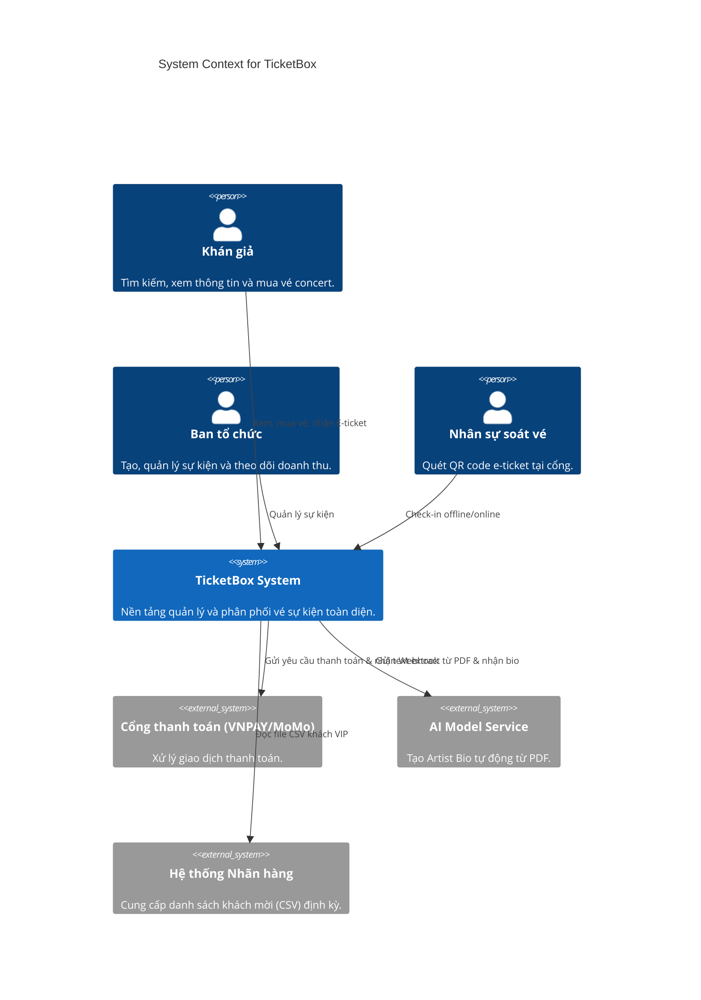
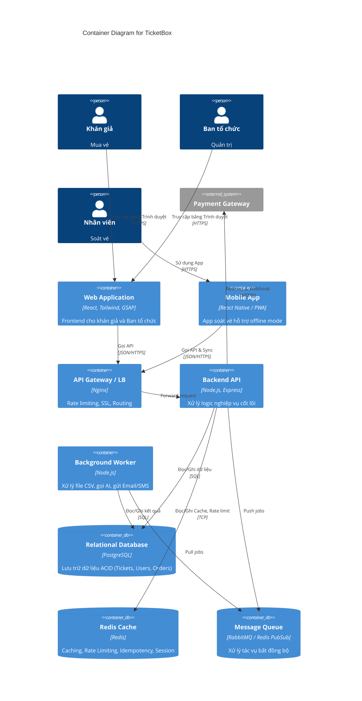
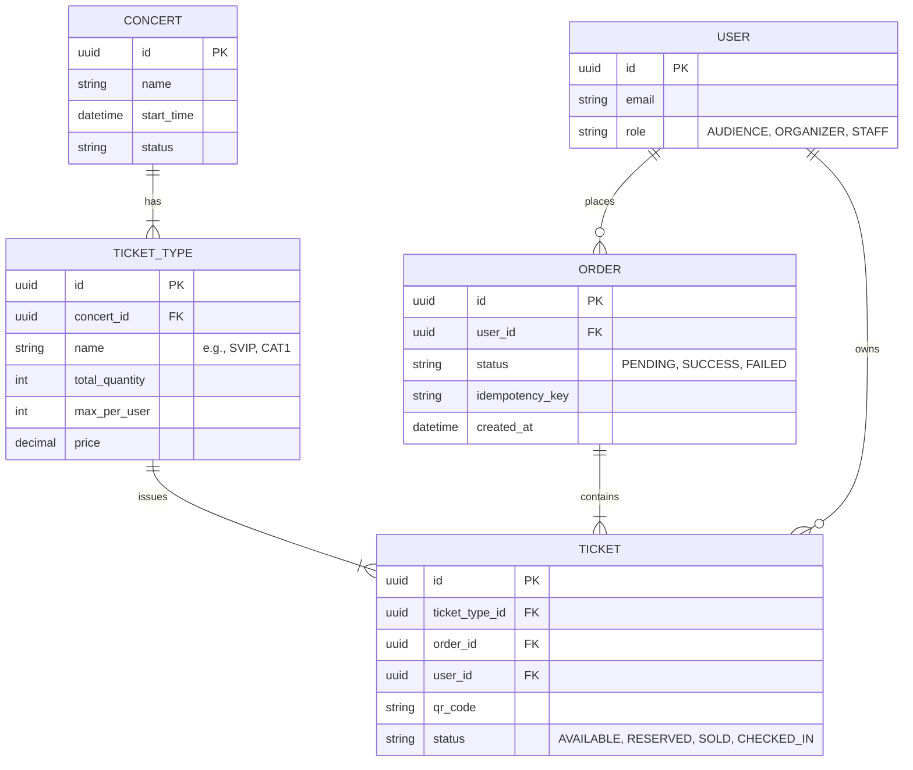

# TicketBox — Technical Design

## 1. C4 Diagram

### Level 1 — System Context
Sơ đồ thể hiện hệ thống TicketBox trong mối tương quan với các tác nhân và hệ thống bên ngoài.

### Level 2 — Container Diagram
Kiến trúc bên trong của hệ thống TicketBox.

## 2. Thiết kế Cơ sở dữ liệu (Database Design)

Chúng ta sử dụng **PostgreSQL** để đảm bảo tính ACID cao nhất cho các giao dịch tài chính và tranh chấp vé.

### Mô hình ERD cốt lõi

### 🔴 QUYẾT ĐỊNH QUAN TRỌNG: Ràng buộc tính vẹn toàn dữ liệu tại Database (Database-level Constraints)
Để giải quyết triệt để bài toán **Giới hạn số vé/user dưới tải cao** (ví dụ: mỗi người chỉ mua tối đa 2 vé SVIP), chúng ta **TUYỆT ĐỐI KHÔNG** dùng logic application-level blocking (ví dụ: `SELECT count -> check ở code Node.js -> INSERT`) vì sẽ sinh ra race condition khi hàng nghìn request đến cùng lúc.

Thay vào đó, phải sử dụng **SQL Migrations** để tạo ra các ràng buộc trực tiếp dưới Database để đảm bảo data integrity:
1. **Trigger / Stored Procedure:** Tạo function đếm số lượng vé của user và gắn trigger `BEFORE INSERT` trên bảng lưu giao dịch/vé.
2. Nếu user mua vượt quá `TICKET_TYPE.max_per_user`, DB sẽ ném ra lỗi (exception) ngay lập tức. Tính năng Transaction Control (ACID) của Database sẽ block cứng việc overselling này một cách đáng vị cậy nhất.

## 3. Các cơ chế bảo vệ hệ thống (ADRs)

### 3.1. Rate Limiting (Kiểm soát tải đột biến)
- **Kỹ thuật:** Sử dụng thuật toán **Token Bucket** triển khai trên **Redis** với cấu hình **Rate Limiting kép**.
- **Lý do:** Giới hạn theo IP thông thường dễ chặn nhầm người dùng hợp lệ dùng chung mạng NAT (như mạng công ty, ký túc xá).
- **Thực thi:**
  - Áp dụng **ngưỡng khắt khe (strict limit)** cho từng `User ID` (ví dụ: 5 requests/giây).
  - Áp dụng **ngưỡng nới lỏng (loose limit)** cho từng địa chỉ IP (ví dụ: 100 requests/giây).
  - Trả về HTTP 429 Too Many Requests nếu vượt ngưỡng.

### 3.2. Circuit Breaker (Xử lý cổng thanh toán không ổn định)
- **Kỹ thuật:** Áp dụng mẫu Circuit Breaker (sử dụng thư viện `opossum`) khi giao tiếp với VNPAY/MoMo.
- **Lý do:** Tránh tình trạng cascade failure khi hệ thống thanh toán gặp sự cố làm kẹt các luồng xử lý nội bộ.
- **Cơ chế:**
  - **Closed:** Hoạt động bình thường.
  - **Open:** Nếu tỉ lệ timeout/lỗi vượt ngưỡng quy định (vd 50% trong 10s), Circuit ngắt kết nối. API trả về thông báo lỗi cho người mua ngay lập tức, trong khi các phần hệ thống khác (xem thông tin concert) vẫn sống.
  - **Half-Open:** Sau khoảng thời gian chờ (vd 30s), cho phép một vài request thăm dò. Nếu thành công -> Closed; nếu lỗi -> lại Open.

### 3.3. Idempotency Key (Chống trừ tiền 2 lần)
- **Kỹ thuật:** Cấp phát một mã băm xác định (deterministic hash).
- **Lý do:** Chống việc khán giả rớt mạng và ấn F5 (reload trang) làm tuột mất vé do sinh ID mới.
- **Cơ chế:**
  - Backend sử dụng hàm băm `Hash(UserID + ConcertID + CartHash)` làm Idempotency-Key.
  - Kiểm tra trạng thái Key trong Redis trước khi xử lý giao dịch.
  - Xử lý mượt mà các luồng double-click hoặc reload trang mà không bao giờ bị trừ tiền hai lần.

### 3.4. Caching cho Ticket Count (Giảm tải Database)
- **Kỹ thuật:** Chiến lược **Cache-aside** trên **Redis**.
- **Vấn đề:** 80.000 user F5 liên tục để xem số lượng vé còn lại trên trang chi tiết, nếu hit trực tiếp Database sẽ gây sập.
- **Thực thi:**
  - Số vé còn lại được cache trong Redis với TTL ngắn (khoảng 5-10s).
  - Lệnh đặt vé thực tế dùng lệnh `DECR` nguyên tử để check nhanh, kết hợp với các ràng buộc SQL dưới Database.

## 4. Quy tắc Cài đặt (Implementation Rules)

Trong quá trình thực thi code, hệ thống cần tuân thủ nghiêm ngặt các yêu cầu sau:

1. **Khởi tạo dữ liệu (Seeding):**
   - Script đổ dữ liệu (`seed.ts` hoặc tương đương) phải được viết thành một file hoàn toàn độc lập.
   - **Tuyệt đối không** được tích hợp hay gọi ngầm bên trong logic khởi động của ứng dụng chính (ví dụ: không được bỏ vào `index.ts` lúc start server). Admin sẽ chạy thủ công khi cần thiết.

2. **Quy chuẩn Frontend:**
   - Mọi cấu trúc layout, phân chia lưới (grid/columns) và căn chỉnh giao diện phải được xử lý **100% bằng CSS Flexbox**.
   - **GSAP** (GreenSock Animation Platform) chỉ được phép sử dụng để xử lý các hiệu ứng hoạt ảnh (animations). Tuyệt đối không dùng GSAP để tính toán hay can thiệp vào layout DOM, làm ảnh hưởng hiệu năng và Responsive.
